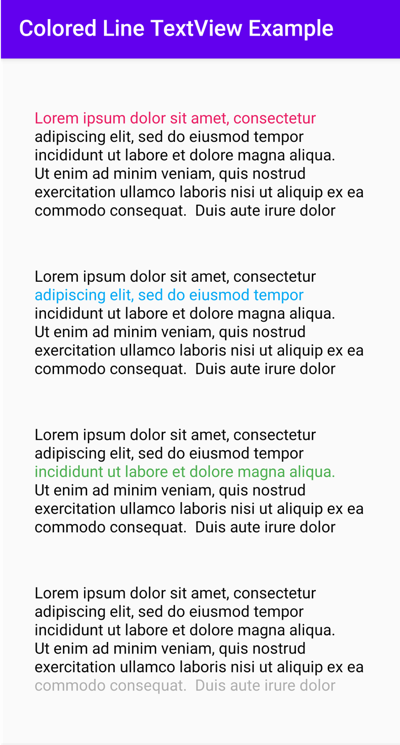

An android custom TextView that allows to change the color of a specific line in a TextView



Usage
-----

* In XML layout:

```xml 
<com.mupadhyay.coloredlinetextview.ColoredLineTextView
    android:id="@+id/textView1"
    android:layout_width="300dp"
    android:layout_height="wrap_content"
    android:layout_margin="50dp"
    android:text="Ian is an experienced professional with a successful career in banking, investment and insurance sales. He possesses excellent interpersonal, analytical and organizational skills necessary for portfolio management"
    app:lineColor="#d9dbda"
    app:lineNumber="1" 
/>
```
                
* All customizable attributes:

```xml
<declare-styleable name="coloredlineAttr">
        <attr name="lineNumber" format="integer"/>
        <attr name="lineColor" format="color"/>
</declare-styleable>
```

Note: 
1. lineNumber < 1 will default to 1st line
2. lineNumber > maxLines will default to last line 

Download
--------

```groovy
implementation 'com.mupadhyay.coloredlinetextview:coloredlinetextview:1.0.0'
```

Snapshots of the development version are available in [Sonatype's `snapshots` repository][snap].

Sample
---------

* Check out the sample app in `colored-line-textview-sample/` to see it in action.

License
-------

    Copyright 2020 Mrunal Upadhyay

    Licensed under the Apache License, Version 2.0 (the "License");
    you may not use this file except in compliance with the License.
    You may obtain a copy of the License at

       http://www.apache.org/licenses/LICENSE-2.0

    Unless required by applicable law or agreed to in writing, software
    distributed under the License is distributed on an "AS IS" BASIS,
    WITHOUT WARRANTIES OR CONDITIONS OF ANY KIND, either express or implied.
    See the License for the specific language governing permissions and
    limitations under the License.


 [snap]: https://oss.sonatype.org/content/repositories/snapshots/
